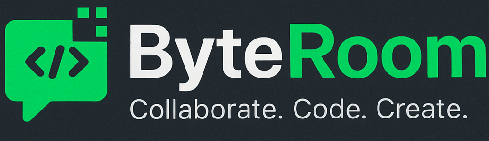

  

<h1 align="center">ByteRoom</h1>

A collaborative, real-time code editor where users can seamlessly code together. It provides a platform for multiple users to enter a room, share a unique room ID, and collaborate on code simultaneously.

## 🔮 Features

- 💻 Real-time collaboration on code editing across multiple files
- 📁 Create, open, edit, save, delete, and organize files and folders
- 💾 Option to download the entire codebase as a zip file
- 🚀 Unique room generation with room ID for collaboration
- 🌍 Comprehensive language support for versatile programming
- 🌈 Syntax highlighting for various file types with auto-language detection
- 🚀 Code Execution: Users can execute the code directly within the collaboration environment
- ⏱ Instant updates and synchronization of code changes across all files and folders
- 📣 Notifications for user join and leave events
- 👥 User presence list with online/offline status indicators
- 💬 Real-time group chatting functionality
- 🎩 Real-time tooltip displaying users currently editing
- 💡 Auto suggestion based on programming language
- 🔠 Option to change font size and font family
- 🎨 Multiple themes for personalized coding experience
- 🎨 Collaborative Drawing: Enable users to draw and sketch collaboratively in real-time
- 🤖 Copilot: An AI-powered assistant that generates code, allowing you to insert, copy, or replace content seamlessly within your files.

## 🚀 Live Preview

You can view the live preview of the project [here](https://byteroom.vercel.app/).

## 💻 Tech Stack

## 🧾 License

This project is licensed under the [MIT License](LICENSE).

## 📝 Author
Rushil Vora | IIT Kharagpur Electrical Engineering

Email: [rushilvora2@gmail.com]
